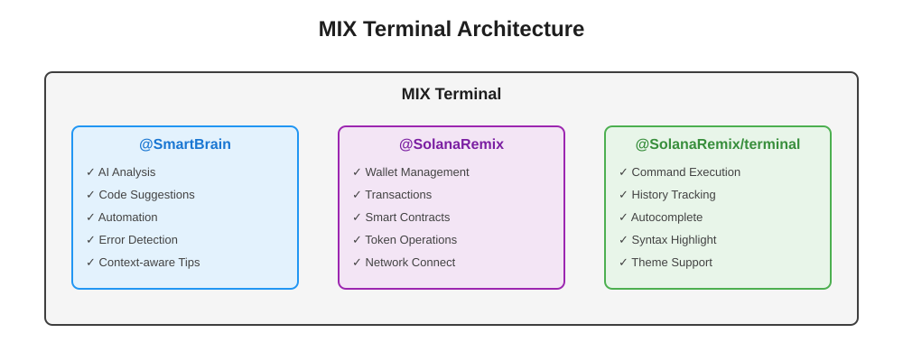
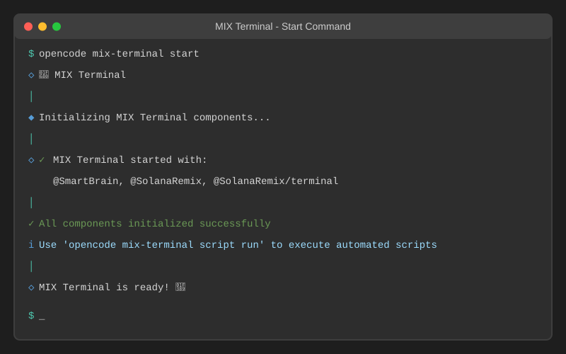
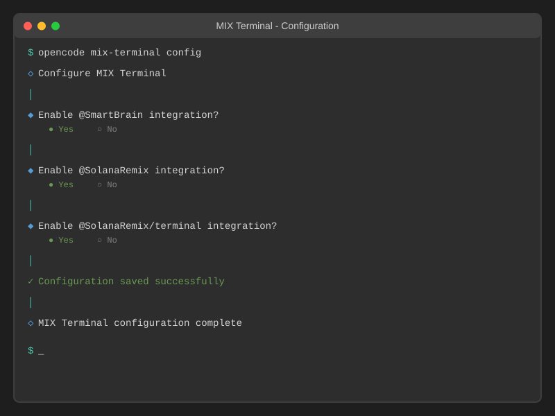
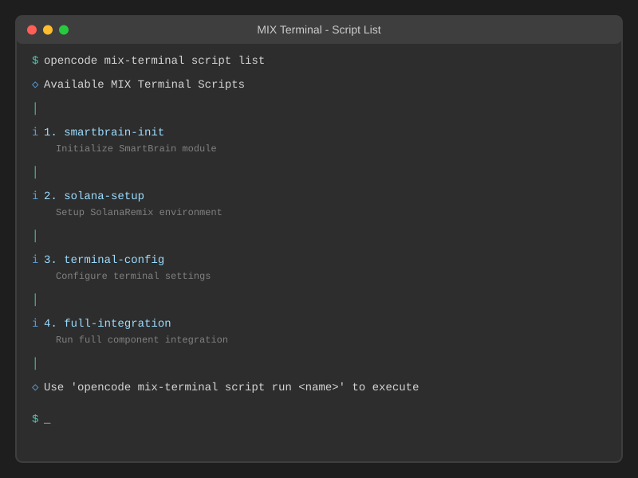

# MIX Terminal

MIX Terminal is an advanced terminal feature for OpenCode that integrates multiple powerful components to provide a comprehensive development environment.

## Overview



## Components

### 1. @SmartBrain

AI-powered intelligence and decision-making capabilities that provide:

- Code analysis and suggestions
- Automated task execution
- Intelligent error detection and resolution
- Context-aware recommendations

### 2. @SolanaRemix

Solana blockchain development and remix capabilities including:

- Wallet management
- Transaction handling
- Smart contract deployment
- Token operations
- Network connectivity (mainnet, testnet, devnet)

### 3. @SolanaRemix/terminal

Enhanced terminal interface with:

- Command execution
- Command history
- Autocomplete functionality
- Syntax highlighting
- Customizable themes

## Installation

MIX Terminal is built into OpenCode. No additional installation is required.

## Usage

### Starting MIX Terminal



```bash
# Start with all components enabled (default)
opencode mix-terminal start

# Start with specific components
opencode mix-terminal start --smartbrain --solana-remix --terminal

# Disable specific components
opencode mix-terminal start --no-smartbrain
```

### Configuration



Configure MIX Terminal settings:

```bash
opencode mix-terminal config
```

Or edit the configuration file directly:

```
packages/opencode/config/mix-terminal.yml
```

### Automated Scripts

MIX Terminal includes advanced automated scripts for common workflows:



#### List Available Scripts

```bash
opencode mix-terminal script list
```

#### Run a Script

```bash
# Initialize SmartBrain
opencode mix-terminal script run smartbrain-init

# Setup Solana environment
opencode mix-terminal script run solana-setup

# Configure terminal
opencode mix-terminal script run terminal-config

# Run full integration
opencode mix-terminal script run full-integration
```

## Available Scripts

1. **smartbrain-init**: Initialize SmartBrain module with advanced configuration
2. **solana-setup**: Setup SolanaRemix development environment with network connectivity
3. **terminal-config**: Configure terminal with optimal settings
4. **full-integration**: Run full integration of all MIX Terminal components

## Configuration

The MIX Terminal configuration file (`config/mix-terminal.yml`) allows you to customize:

- SmartBrain model and features
- Solana network settings (mainnet/testnet/devnet)
- Terminal theme and appearance
- Automated script scheduling
- Logging preferences
- Performance settings

## Workflow Automation

MIX Terminal includes GitHub Actions workflow automation:

- Automatic testing on push to main/dev branches
- Manual workflow dispatch for running scripts
- Health checks for all components
- Environment-specific configurations

To trigger the workflow manually:

1. Go to Actions tab in GitHub
2. Select "MIX Terminal Automation"
3. Click "Run workflow"
4. Choose script and environment
5. Click "Run workflow" button

## Architecture

```
mix-terminal/
├── index.ts                 # Main integration module
├── smartbrain.ts           # SmartBrain integration
├── solana-remix.ts         # SolanaRemix integration
├── solana-remix-terminal.ts # Terminal integration
└── scripts/
    └── automated.ts        # Automated scripts
```

## API

### MixTerminal

```typescript
import { MixTerminal } from "./mix-terminal"

// Initialize all components
await MixTerminal.initialize(config)

// Get status
const status = MixTerminal.getStatus()

// Shutdown
await MixTerminal.shutdown()

// Get default configuration
const config = MixTerminal.getDefaultConfig()
```

### SmartBrain

```typescript
import { SmartBrain } from "./mix-terminal"

// Initialize
await SmartBrain.initialize({ enabled: true })

// Process command
await SmartBrain.process("command", context)

// Get status
SmartBrain.getStatus()
```

### SolanaRemix

```typescript
import { SolanaRemix } from "./mix-terminal"

// Initialize
await SolanaRemix.initialize({ enabled: true, network: "devnet" })

// Connect to network
await SolanaRemix.connect("devnet")

// Get wallet
await SolanaRemix.getWallet()

// Deploy program
await SolanaRemix.deployProgram("path/to/program")
```

### SolanaRemixTerminal

```typescript
import { SolanaRemixTerminal } from "./mix-terminal"

// Initialize
await SolanaRemixTerminal.initialize({ enabled: true, theme: "dark" })

// Execute command
await SolanaRemixTerminal.executeCommand({ name: "ls", args: ["-la"] })

// Get history
SolanaRemixTerminal.getHistory()

// Clear terminal
SolanaRemixTerminal.clear()
```

## Contributing

Contributions to MIX Terminal are welcome! Please follow the [contributing guidelines](../../CONTRIBUTING.md).

## License

MIT License - see [LICENSE](../../LICENSE) file for details.
